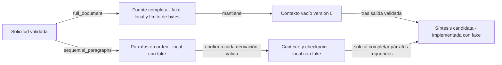
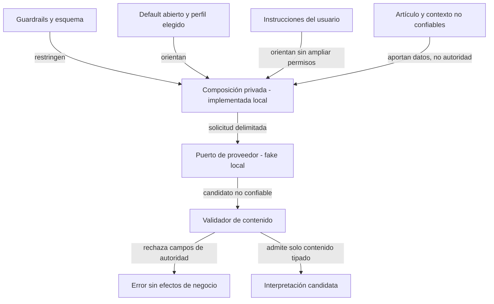
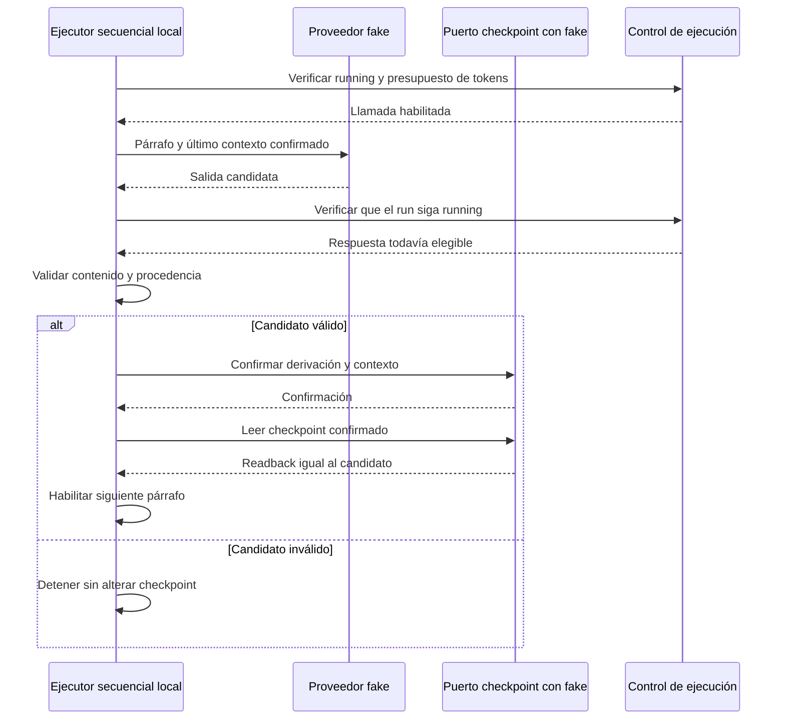

# Pipeline gobernado de artículos

## Rol, estado y fuentes

Rol primario: guía técnica explicativa. Owner: sst-chatbot.
Estado: **recorrido, checkpoints, candidata final y control de ejecución con fakes implementados**,
CR-SST-0224, revisión 2026-09-10-unit-6. Aceptación canónica e integración pendientes.
No es un runbook ni autoriza despliegues.

Fuente local: [spec del pipeline](../../specs/architecture/article-processing-pipeline.yaml).
Lineage: contrato `sst-article-agent-processing-v1@1.0.0` de CR-SST-0220,
publicado por el control-plane. La spec enlaza su repositorio y ruta.

Esta unidad fija tipos de entrada y contenido de salida, no endpoints ni tablas.
No cambia las APIs existentes de chat ni el transporte de propuestas de memoria.

## Contratos implementados

`src/app/article_processing/contracts.py` contiene valores Pydantic inmutables,
validación estricta, rechazo de campos desconocidos y revalidación de instancias
anidadas. No es un contrato wire para Bend.

- `RunScope`: tenant, account, user y application. Tener estos campos no prueba autorización.
- `SourceSnapshot`: artículo, versión, identidad del snapshot, contenido y hash SHA-256 del UTF-8 exacto.
- `PromptSnapshot`: versiones de prompt, perfil, guardrails y esquema; hash de instrucciones. El default es `open-general-analysis`.
- `ParagraphSequence`: secuencia no vacía, inmutable, ascendente y sin ordinales duplicados. El origen y segmentación siguen siendo responsabilidad upstream.
- `AnalysisRequest`: vincula run, scope, source, modo, prompt, cadena e idempotency key. Modo completo no recibe secuencia; modo secuencial la requiere y verifica el source ID.
- `AnalysisContent`: evidencia, inferencias, incertidumbre, preguntas y síntesis. No admite estado de negocio, permisos, aceptación de memoria ni comandos.

Los valores no verifican por sí solos acceso, unicidad durable de run, presupuesto
de tokens por sí solos ni si las afirmaciones generadas son verdaderas. El parser JSON del
proveedor y su normalización a los tipos locales se implementaron en la unidad 3.
Nunca debe utilizarse `model_construct` como vía de validación de entradas externas.

Los campos privados no aparecen en `repr`; los errores convertidos a string
ocultan el input. **Esto no vuelve seguros `model_dump()`, `errors()` ni una
traza de proveedor**: contienen valores privados. La futura frontera runtime
debe emitir códigos saneados, nunca serializar esos objetos en logs.

## Composición implementada y configuración del usuario

`compose_article_prompt` reutiliza catálogo, renderer y assembler existentes.
Resuelve `task.article_analysis@1`, con perfil `open-general-analysis@1` y
guardrails versión 1. Rechaza versiones o perfiles no soportados en lugar de
resolver silenciosamente la versión más nueva. El prompt continúa draft.

El desarrollador mantiene plantilla y reglas; el usuario aporta instrucciones
de análisis. Se insertan como datos JSON en un mensaje human, nunca como una
plantilla evaluable ni mensaje system. El artículo también entra como datos.
Cambiar las instrucciones cambia el hash renderizado; no cambia las reglas.
La identidad única y persistencia de runs siguen siendo responsabilidad de Bend.

Los límites de composición son parámetros obligatorios del código owner:
bytes UTF-8 de instrucciones, fuente, contexto y mensajes renderizados. Se
rechaza exceso sin truncado. No se presentan como tokens ni como configuración
libre del usuario. La política separada de ejecución exige un contador compatible
con el proveedor/modelo y aplica sus techos antes de cada llamada. El contexto
secuencial lo aportará el checkpoint; esta función no certifica su procedencia
ni decide el siguiente párrafo.

El objeto renderizado contiene material privado. Solo `trace_metadata` puede
utilizarse para observabilidad conforme al contrato; no registrar el objeto
entero, mensajes o variables. El hash no conserva el contenido ni lo anonimiza.

Procesar un artículo representa una ejecución de tarea acotada. No crea una
identidad persistente de agente ni cambia la personalidad de `/chat`. La idea
de un ciclo de vida general de agentes y estilos elegidos por usuario queda
como evolución a analizar mediante un alcance separado, no como implementación
implícita dentro de CR-SST-0224. Las instrucciones puntuales no incluyen
automáticamente el historial de conversación.

## Frontera de proveedor implementada

`analyze_once` compone una solicitud y llama una vez al puerto `ArticleProvider`.
La implementación disponible es un fake determinista en tests, sin conexión a
proveedores reales. Recibe mensajes inmutables, timeout y límite de tokens de
salida. No recibe objetos de autorización ni acceso a Bend.

`parse_analysis_reply` requiere un único objeto JSON y todos los campos del
esquema, incluida su versión. Rechaza claves duplicadas, campos extra, NaN,
Markdown, tipos incompatibles y síntesis vacía. Convierte arrays JSON en tuplas
sin convertir sus elementos. No repara ni completa respuestas del modelo.

Una respuesta truncada, rechazada, inválida o una excepción devuelve un código
saneado sin respuesta parcial exitosa. `ValidatedAnalysis` contiene interpretación
y hash del prompt: no es una FINAL_DERIVATION ni un run completado. No hay retries.

El límite de bytes se verifica tras recibir el texto. El adaptador real futuro
deberá limitar el transporte antes de acumularlo en memoria y respetar timeout y
tokens de salida. El puerto síncrono no interrumpe un adaptador colgado; estos
tests simulan timeout y cambio de estado, no prueban cancelación real del transporte.

## Control de lifecycle y presupuesto de tokens

`ExecutionControl` exige dos puertos: `RunLifecyclePort`, que consulta el estado
autoritativo de un run, e `InputTokenCounter`, que cuenta los mensajes ya
renderizados según el proveedor/modelo elegido. `ExecutionLimits` versiona esa
política y fija tanto el máximo de entrada como la ventana total de contexto.

Antes de llamar al proveedor se exige `running`, se cuenta la entrada y se
reserva el máximo configurado de salida dentro de la ventana. Al regresar se
consulta nuevamente el estado: si el run fue pausado, cancelado o terminado,
la respuesta se descarta antes del parseo, checkpoint o candidata final. Fallas
del lector o contador cierran la ejecución con códigos saneados.

El fake demuestra el protocolo, no la exactitud de tokens de un modelo real.
El futuro adaptador debe aportar su contador compatible y limitar streaming
antes de acumular la respuesta. Tampoco se afirma que el puerto síncrono pueda
interrumpir una petición en vuelo: se evita adoptar su respuesta cuando vuelve.

## Recorrido secuencial y recuperación local

`run_paragraphs` carga y valida un prefijo confirmado del run. Cada párrafo recibe
el contexto de ese prefijo. Tras validar la respuesta se construye una derivación
con ordinal, versión de contexto de entrada, snapshot del prompt, hash renderizado
e identidad determinista. El adaptador confirma atómicamente la nueva versión y
el ejecutor verifica su readback antes de avanzar.

La cadena se liga mediante hash al request completo y a las políticas/límites
de composición, proveedor y ejecución.
Cambiar scope, fuente, prompt o límites dentro del mismo run se rechaza. No prueba
autorización: el adaptador debe aplicar el scope validado por Bend. Las claves de
párrafo son estables y el reintento explícito salta entradas confirmadas. Un fallo
de proveedor o guardado detiene el recorrido. Si se perdió la confirmación de un
guardado exitoso, el siguiente intento lo recupera leyendo el store.

Política inicial `context-prefix-bytes-v1`: conserva categorías de análisis y
procedencia completas. Si una entrada supera el presupuesto de contexto, no se
confirma ni se continúa. No hay compactación ni truncado silencioso. Los límites
siguen siendo bytes, no tokens del modelo. La compactación queda pendiente.

El store es un puerto con un fake en tests. Debe comparar versión y agregar una
entrada de forma atómica. Llamadas concurrentes al modelo podrían repetirse; el
CAS del adaptador impide confirmar dos veces. No se afirma ejecución del modelo
exactamente una vez ni durabilidad al reiniciar procesos. El objeto devuelto es
un checkpoint de párrafos, nunca un resultado final o memoria aceptada. La
consulta de estado está definida por puerto y probada con fake; su integración
durable con el owner sigue pendiente.

## Síntesis final candidata y procedencia

`synthesize_final` usa el mismo lector de lifecycle antes y después de la llamada.
No es una autorización del usuario ni reemplaza el control de acceso de Bend.
Rechaza estados distintos de running antes de llamar y descarta la respuesta si
el estado cambia durante la llamada. Bend debe volver a verificar el estado al
aceptar atómicamente el resultado.

En full_document analiza la fuente completa con contexto versión 0 y cero
referencias a párrafos. En sequential_paragraphs lee el checkpoint, valida su
binding y exige todos los párrafos. La etapa privada `task.article_final_stage@1`
solicita síntesis de las interpretaciones confirmadas, conservando evidencia,
inferencia e incertidumbre. Después verifica que el checkpoint no cambió.

`FinalCandidate` conserva run, artículo, fuente y hash, snapshot del prompt, modo,
cadena y versión, IDs de derivaciones y hash del prompt final. La política
`article-final-v1` identifica la composición. No es el registro FINAL_DERIVATION
canónico ni ARTICLE_PROCESSING_RESULT: no agrega timestamps ni decide adopción.

Repetir los mismos inputs conserva candidate_id; el proveedor puede producir
otro texto. La futura aceptación de Bend debe aplicar idempotencia y detectar
conflictos, no sobrescribir un resultado anterior. No hay cache final durable.

## Mapa de modos: objetivo de ejecución

<!-- visual-map:start -->

```yaml
visual_map:
  schema_version: "1.0"
  id: "article-owner-mode-target"
  type: "dependency"
  question: "Qué cambia entre lectura completa y secuencial?"
  abstraction_level: "Responsabilidades lógicas del pipeline."
  source_refs:
    - "specs/architecture/article-processing-pipeline.yaml"
  observed_at: "2026-09-10"
  authority_boundary: "Vista derivada; la spec owner conserva autoridad local. Representa implementación local con fakes; integraciones reales pendientes."
  textual_fallback_required: true
```



### Fallback textual

```text
La solicitud distingue dos modos. El completo analiza la fuente íntegra dentro
del presupuesto y mantiene contexto vacío versión 0. El secuencial confirma
derivación y contexto antes de avanzar. Solo una finalización válida habilita
síntesis. El recorrido secuencial está implementado con fake y política de
contexto por bytes. La candidata a síntesis está implementada con fake;
la aceptación canónica y la integración durable siguen pendientes.
```

<!-- visual-map:end -->

## Mapa de confianza: objetivo de composición

<!-- visual-map:start -->

```yaml
visual_map:
  schema_version: "1.0"
  id: "article-owner-prompt-target"
  type: "dependency"
  question: "Qué puede orientar al modelo y qué restringe su salida?"
  abstraction_level: "Responsabilidades lógicas del pipeline."
  source_refs:
    - "specs/architecture/article-processing-pipeline.yaml"
  observed_at: "2026-09-10"
  authority_boundary: "Vista derivada; la spec owner conserva autoridad local. Representa implementación local con fakes; integraciones reales pendientes."
  textual_fallback_required: true
```



### Fallback textual

```text
Guardrails y esquema restringen la composición. Default, perfil e instrucciones
orientan el análisis sin dar nuevos permisos. Artículo y contexto son datos.
La composición y el puerto están implementados con fake local, sin proveedor real.
El contrato local de contenido
rechaza campos de autoridad y solo admite una interpretación candidata.
Validar su forma no garantiza verdad factual ni inmunidad universal a inyección.
```

<!-- visual-map:end -->

## Mapa de checkpoint: objetivo de secuencia

<!-- visual-map:start -->

```yaml
visual_map:
  schema_version: "1.0"
  id: "article-owner-checkpoint-target"
  type: "sequence"
  question: "Cuándo se permitirá avanzar al siguiente párrafo?"
  abstraction_level: "Responsabilidades lógicas del pipeline."
  source_refs:
    - "specs/architecture/article-processing-pipeline.yaml"
  observed_at: "2026-09-10"
  authority_boundary: "Vista derivada; la spec owner conserva autoridad local. Representa implementación local con fakes; integraciones reales pendientes."
  textual_fallback_required: true
```



### Fallback textual

```text
El ejecutor local verifica estado y presupuesto antes de enviar párrafo y
contexto confirmado al proveedor fake, y vuelve a verificar estado al recibirlo.
Si el candidato pasa validación, confirma derivación y contexto mediante un
puerto y verifica readback antes de avanzar. Si falla, detiene y el reintento
recarga el último checkpoint confirmado. Puerto y algoritmo están implementados
localmente; el fake no demuestra persistencia entre procesos. La integración
durable corresponde a CR-SST-0225.
```

<!-- visual-map:end -->

## Próximas unidades dentro del plan aprobado

1. Prompt privado y composición completados localmente; falta promoción del draft.
2. Llamada aislada y normalización completadas con fake; falta adaptador real.
3. Recorrido y checkpoints completados con fakes; falta integración durable y compactación por tokens.
4. Candidata final y procedencia completadas localmente; falta aceptación canónica.
5. Guard de lifecycle y presupuesto implementado con puertos y fakes; faltan los
   adaptadores reales de estado y conteo específico del modelo.

No aceptar memoria automáticamente. Bend conserva autorización y persistencia
de resultados; resumen draft y propuesta needs_review son proyecciones distintas.
Esta unidad no entrega la experiencia Fend ni el handoff durable.

## Validación de la unidad

Finalización: [test_article_processing_finalization.py](../../tests/test_article_processing_finalization.py).
Se prueban ambos modos, procedencia, identidad estable, estados no elegibles,
prefijo incompleto, salida inválida y cambio del checkpoint durante la síntesis.

Recorrido: [test_article_processing_sequential.py](../../tests/test_article_processing_sequential.py).
Casos: orden, contexto acumulado, reintento sin duplicados, fallo del proveedor,
guardado fallido, confirmación perdida, binding incompatible, presupuesto,
checkpoint corrupto, readback ausente y conflicto de versión del fake.

Tests: [test_article_processing_contracts.py](../../tests/test_article_processing_contracts.py).
Composición: [test_article_processing_prompts.py](../../tests/test_article_processing_prompts.py).
Proveedor: [test_article_processing_provider.py](../../tests/test_article_processing_provider.py),
con fake y casos de JSON inválido, estados no exitosos, límites y errores saneados.
Ejecución: [test_article_processing_execution.py](../../tests/test_article_processing_execution.py),
con estado previo/posterior, reserva de salida, límites de entrada/ventana,
contador inválido y descarte de respuesta ante pausa concurrente.
Se prueban capas, inyección como datos sin nuevos roles, hash estable, cambios de
instrucciones, límites de bytes, selección de párrafo, privacidad de metadata y
rechazo de snapshots incompatibles. Estos tests no demuestran inmunidad del LLM.
Cubren modos, hashes exactos, orden, snapshots inmutables, rechazo de campos
extras, tipos estrictos, fuente incompatible y ocultamiento básico de inputs.

QA documental: confirmar fuentes, límites de autoridad y distinción entre
contrato implementado y runtime pendiente. La ejecución de `scripts/check.py`
se registra en la evidencia del control-plane; usa tests y smokes con proveedores
simulados. No equivale a QA de usuario ni a pruebas con proveedor real.

El QA de usuario futuro sigue reservado a MCP Chrome DevTools y datos creados
por interfaz, sin DB scripts ni seeders. No se agregan endpoints HTTP ni cambia
el harness HTTP existente en esta unidad.
