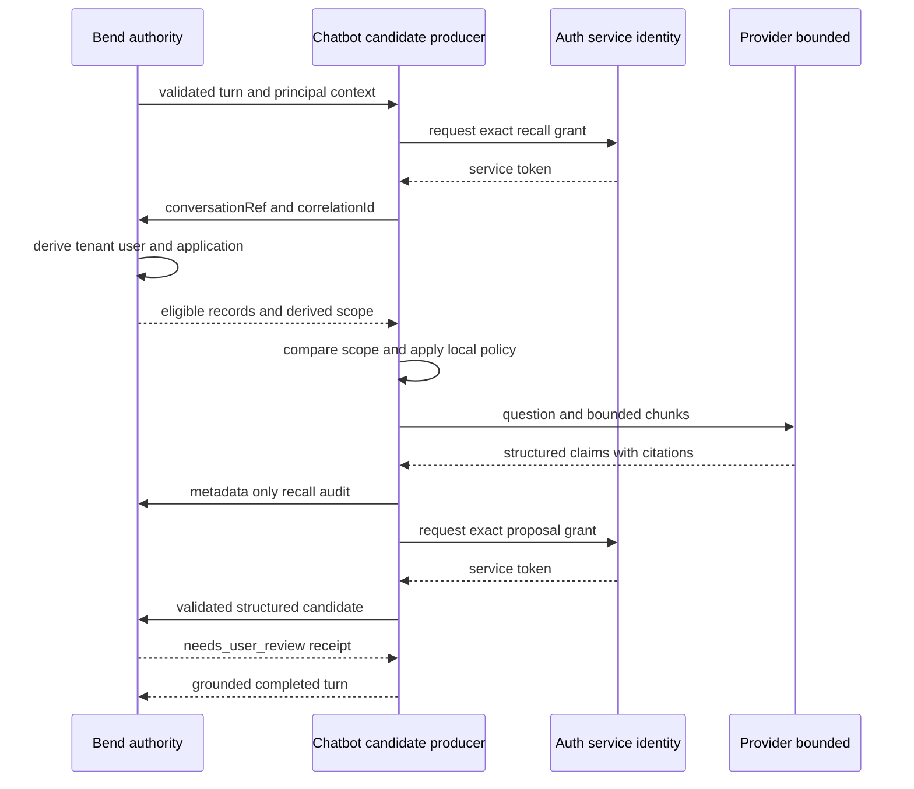

# Integración Gobernada De Memoria En El Chat

## Resultado

CR-SST-0194 conecta el kernel RAG del chatbot con la memoria canónica de Bend.
El chatbot puede recuperar contexto autorizado, registrar las citas utilizadas
y entregar un candidato opcional generado desde el desarrollo final. Ese
candidato siempre queda en `needs_user_review`: no es memoria adoptada hasta
que el usuario la acepte mediante la superficie gobernada por Bend.

El contrato estructurado vive en
`specs/integrations/sst-governed-user-memory-chat.yaml`.

## Mapa De La Dinámica

<!-- visual-map:start -->

```yaml
visual_map:
  schema_version: "1.0"
  id: "sst-chatbot-governed-memory-runtime"
  type: "sequence"
  question: "Cómo usa y propone memoria el chatbot sin adquirir autoridad canónica?"
  abstraction_level: "owner runtime integration"
  source_refs:
    - "specs/integrations/sst-governed-user-memory-chat.yaml"
    - "src/app/user_memory/runtime.py"
    - "src/app/user_memory/source.py"
    - "src/app/user_memory/bend_client.py"
  observed_at: "2026-08-23"
  authority_boundary: "Bend resuelve scope y conserva memoria; el chatbot sólo recupera contexto y entrega propuestas pendientes."
  textual_fallback_required: true
  request_ids: ["CR-SST-0194"]
  initiative_ids: ["INIT-SST-0010"]
  status_vocabulary: ["validated", "authorized", "needs_user_review"]
```



## Fallback Textual

```text
Bend valida el turno y llama al chatbot.
El chatbot obtiene un token exclusivo de recall y consulta con referencias opacas.
Bend reconstruye el scope y devuelve sólo records elegibles junto con scope derivado.
El chatbot compara ese scope, filtra localmente y entrega contexto acotado al provider.
Una respuesta válida registra primero sus citas en Bend.
El desarrollo final puede producir un candidato estructurado con otro token exclusivo.
Bend asigna needs_user_review; sólo el usuario decide su adopción posterior.
```

<!-- visual-map:end -->

## Límites De Datos

- `PrincipalContext` se utiliza sólo para comprobar el scope devuelto por Bend;
  no forma parte del body enviado a Bend ni del contexto del provider.
- Los tokens usan caché por tuple `audience + scope`; recall y proposal nunca
  comparten un grant implícito.
- El provider recibe únicamente título, contenido y `chunk_id` de chunks que ya
  atravesaron la policy local.
- El audit conserva IDs, citas opacas, contadores y códigos; no conserva query,
  prompt, respuesta ni credenciales.
- El `proposal_builder` devuelve un contrato tipado. Se rechazan credenciales,
  clasificaciones `restricted` o `secret` y claves de trace del runtime/provider.

## Fallos Y Cancelación

La lectura de memoria falla cerrada antes de llamar al provider si Bend no está
disponible, devuelve un contrato inválido o su scope no coincide con el turno.
Una respuesta basada en memoria no se completa si falla el audit o el handoff
de su candidato. Los errores que cruzan el runtime HTTP se reducen a códigos
sanitizados; cuerpos remotos, tokens y contenido recuperado no se registran.

La desconexión HTTP existente corta la emisión sin crear autoridad adicional.
No existe retry automático: la idempotencia del candidato deriva de
`conversation_id + message_id`, y cualquier reintento debe ser explícito.

## Validación

```powershell
.\.venv\Scripts\python.exe -m pytest tests/test_user_memory_integration.py
.\.venv\Scripts\python.exe scripts/check.py
```
